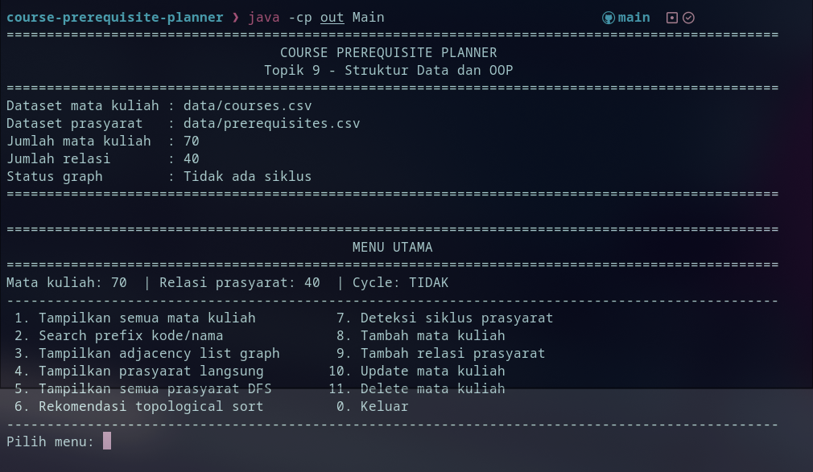
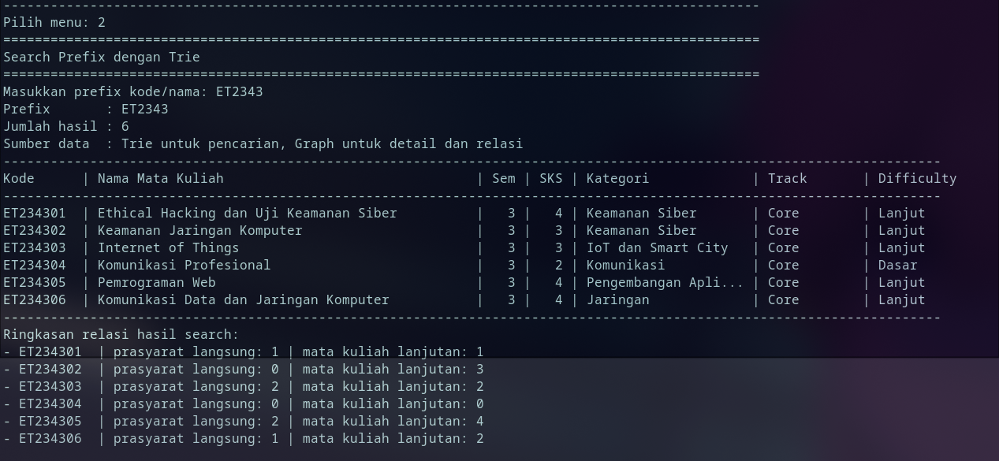
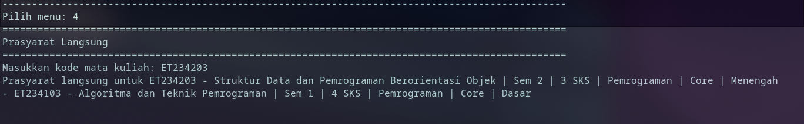
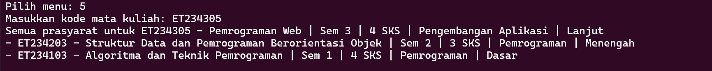
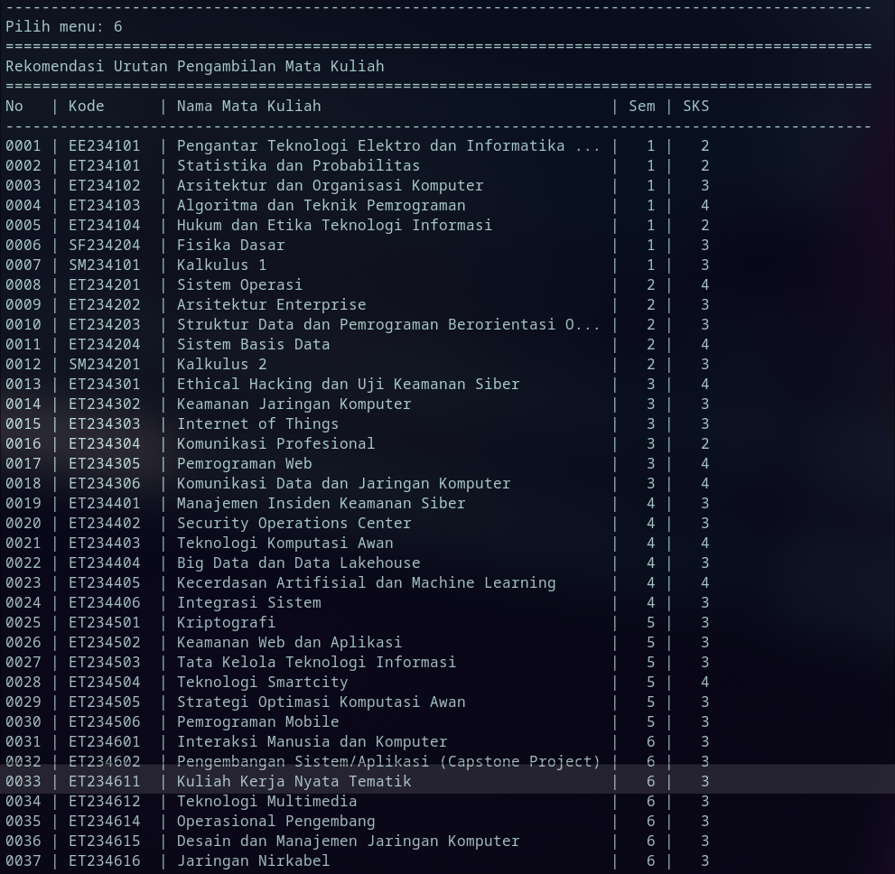
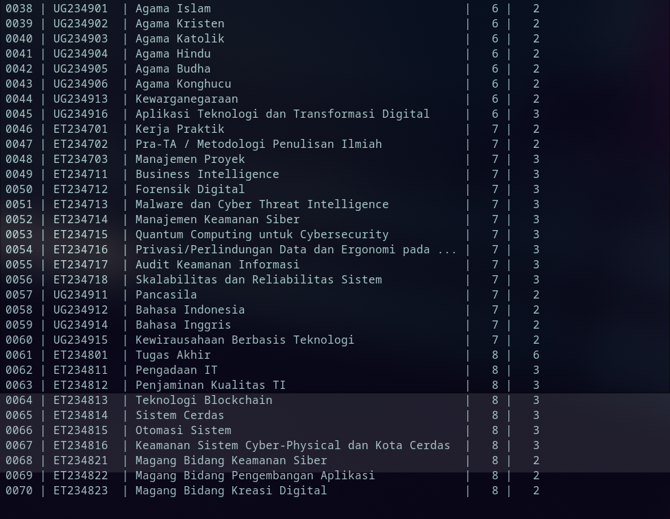
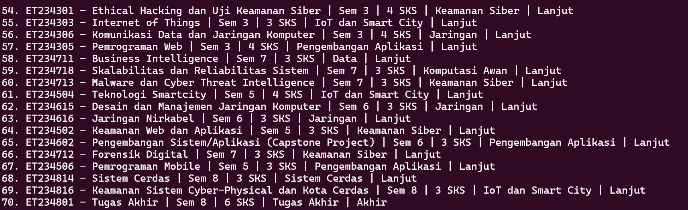
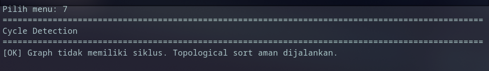
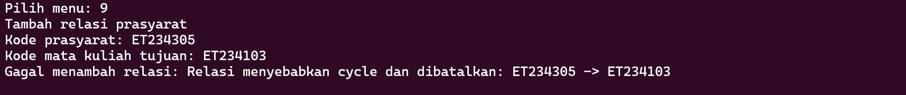

# Course Prerequisite Planner

Data Structure and OOP Final Project
Topic 9: Course Prerequisite Planner.

Project ini merupakan aplikasi berbasis Java CLI untuk membantu menentukan urutan pengambilan mata kuliah berdasarkan hubungan prasyarat. Project menggunakan struktur data Directed Graph untuk relasi prasyarat dan Trie untuk pencarian mata kuliah berdasarkan prefix kode atau nama. Struktur folder repo menunjukkan file utama berada di ```src/Main.java, src/graph/CourseGraph.java, src/tree/Trie.java, src/tree/TrieNode.java, dan src/model/Course.java```

## Folder Structure

```text
FP_Strukdat_Kelompok9/
├── src/
│   ├── Main.java
│   ├── graph/
│   │   └── CourseGraph.java
│   ├── tree/
│   │   ├── Trie.java
│   │   └── TrieNode.java
│   └── model/
│       └── Course.java
├── data/
│   ├── courses.csv
│   └── prerequisites.csv
├── docs/
│   └── README_docs.txt
└── README.md
```

## How to Compile

Run this from the root project folder:

```bash
javac -d out src/Main.java src/model/Course.java src/graph/CourseGraph.java src/tree/Trie.java src/tree/TrieNode.java
```

Or, if you're using Linux, you can do this instead:

```bash
javac -d out $(find src -name "*.java")
```

## How to Run

```bash
java -cp out Main
```

Or, if the dataset path is different:

```bash
java -cp out Main data/courses.csv data/prerequisites.csv
```
## Nama Anggota Kelompok

1. Catur Setyo Ragil - 502725066
2. Aura Syahzanani A - 5027251123
3. Donnavie Aulia - 5027251093
4. Nur Rizki Syahbana - 5027251095
5. .....

## Deskripsi Masalah

Dalam kurikulum perkuliahan, banyak mata kuliah yang memiliki prasyarat. Contohnya, mahasiswa harus mengambil mata kuliah dasar terlebih dahulu sebelum mengambil mata kuliah lanjutan. Jika hubungan prasyarat tidak dikelola dengan baik, mahasiswa dapat mengalami kesalahan dalam menyusun rencana studi.

Masalah yang diselesaikan oleh program ini adalah:

1. Mencari mata kuliah berdasarkan kode atau nama.
2. Menampilkan prasyarat langsung dari suatu mata kuliah.
3. Menampilkan seluruh rantai prasyarat langsung dan tidak langsung.
4. Membuat rekomendasi urutan pengambilan mata kuliah.
5. Mendeteksi konflik kurikulum berupa siklus prasyarat.
6. Mensimulasikan penambahan, update, dan penghapusan mata kuliah.

Program dibuat dalam bentuk CLI sehingga pengguna dapat memilih fitur melalui menu terminal. Menu program mencakup pencarian mata kuliah, adjacency list, prasyarat langsung, semua prasyarat, topological sort, deteksi cycle, tambah mata kuliah, tambah relasi, update, dan delete mata kuliah

## Dataset

Dataset disimpan dalam file CSV, bukan hardcoded di dalam kode Java. File utama yang digunakan adalah:

```bash
data/courses.csv
data/prerequisites.csv
```

Berdasarkan dokumentasi implementasi project, dataset berisi :

| Jenis Data       | Jumlah |
| ---------------- | -----: |
| Mata kuliah      |     70 |
| Relasi prasyarat |     40 |

Jumlah tersebut sudah memenuhi requirement minimal, yaitu minimal 25 node/vertex dan 40 edge/relasi prasyarat.

Data mata kuliah dibaca dari ```courses.csv```, sedangkan data relasi prasyarat dibaca dari ```prerequisites.csv```. Program membaca data tersebut saat runtime menggunakan class CourseGraph

Contoh format data mata kuliah:

| course_code | course_name       | semester | sks | category | track | difficulty |
| ----------- | ----------------- | -------: | --: | -------- | ----- | ---------- |
| ET234103    | Dasar Pemrograman |        1 |   3 | Wajib    | Umum  | Medium     |

Contoh format relasi prasyarat:

| prerequisite_code | course_code |
| ----------------- | ----------- |
| ET234103          | ET234203    |

**Analisis Struktur Data**

Pada sistem **Course Prerequisite Planner**, struktur data utama yang digunakan adalah **Graph directed** dan **Trie**.

- **Graph directed** digunakan untuk merepresentasikan hubungan prasyarat antar mata kuliah.
  - Node/vertex merepresentasikan mata kuliah.
  - Edge merepresentasikan relasi prasyarat.
  - Arah edge menunjukkan ketergantungan, misalnya `A -> B` berarti mata kuliah A harus diambil sebelum B.

- **Trie** digunakan untuk pencarian mata kuliah berdasarkan prefix nama atau kode mata kuliah.
  - Setiap karakter pada kode/nama mata kuliah disimpan sebagai node Trie.
  - Trie memudahkan pencarian prefix seperti `IF`, `IF2`, atau `MAT`.

**Notasi Kompleksitas**

| Simbol | Keterangan |
|---|---|
| `V` | Jumlah vertex/node, yaitu jumlah mata kuliah |
| `E` | Jumlah edge, yaitu jumlah relasi prasyarat |
| `L` | Panjang string kode/nama mata kuliah |
| `K` | Jumlah prasyarat langsung yang diproses |
| `N` | Jumlah data mata kuliah pada Trie |

## Struktur Graph yang Digunakan

Struktur graph yang digunakan adalah Directed Graph.

Pada program, node merepresentasikan mata kuliah, sedangkan edge merepresentasikan relasi prasyarat. Arah edge adalah:

```prerequisite_code -> course_code```

Artinya:

```A -> B```

berarti mata kuliah A adalah prasyarat untuk mata kuliah B.

Implementasi graph berada pada file:

```src/graph/CourseGraph.java```

Struktur data utama yang digunakan dalam CourseGraph adalah:

```bash
Map<String, Course> courses;
Map<String, List<String>> adjacencyList;
Map<String, List<String>> reverseAdjacencyList;
```

Fungsi masing-masing struktur:

| Struktur               | Fungsi                                                         |
| ---------------------- | -------------------------------------------------------------- |
| `courses`              | Menyimpan data mata kuliah berdasarkan kode                    |
| `adjacencyList`        | Menyimpan relasi dari prasyarat ke mata kuliah lanjutan        |
| `reverseAdjacencyList` | Menyimpan relasi dari mata kuliah ke daftar prasyarat langsung |

Program menggunakan adjacencyList untuk topological sort dan cycle detection, sedangkan reverseAdjacencyList digunakan untuk mencari prasyarat langsung maupun tidak langsung.

## Struktur Tree yang Digunakan

Struktur tree yang digunakan adalah Trie.

Trie digunakan untuk fitur pencarian mata kuliah berdasarkan prefix kode atau nama. Implementasinya berada pada:

```bash
src/tree/Trie.java
src/tree/TrieNode.java
```

Pada program, kode dan nama mata kuliah dimasukkan ke Trie. Setiap node pada Trie menyimpan kumpulan kode mata kuliah yang memiliki prefix tersebut.

Contoh:

```Input prefix: ET234```

Program akan mencari semua mata kuliah yang kode atau namanya diawali dengan ```ET234.```

Method utama pada Trie:

```bash
insert(String key, String courseCode)
searchByPrefix(String prefix)
```

Program melakukan normalisasi input dengan mengubah teks menjadi lowercase dan menghapus spasi di awal/akhir. Setelah prefix ditemukan, program mengembalikan kumpulan kode mata kuliah yang cocok.

## Algoritma yang digunakan

**a. DFS untuk Menampilkan Semua Prasyarat**

DFS digunakan untuk mencari semua prasyarat dari suatu mata kuliah. Program menelusuri ```reverseAdjacencyList```, karena struktur tersebut menyimpan relasi dari mata kuliah ke prasyaratnya

Contoh :

```ET234103 -> ET234203 -> ET234305```

Jika dicari semua prasyarat dari ```ET234305```, maka hasilnya adalah:

```bash
ET234203
ET234103
```

**b. Cycle Detection**

Cycle detection digunakan untuk mendeteksi konflik prasyarat. Program menggunakan DFS dengan status kunjungan:

| Status | Arti               |
| -----: | ------------------ |
|      0 | Belum dikunjungi   |
|      1 | Sedang dikunjungi  |
|      2 | Selesai dikunjungi |

Jika saat DFS ditemukan node dengan status 1, maka graph memiliki cycle.

```bash
A -> B
B -> A
```

Relasi tersebut tidak valid karena A membutuhkan B, tetapi B juga membutuhkan A.

**c. Topological Sort**

Topological Sort digunakan untuk menentukan rekomendasi urutan pengambilan mata kuliah. Program menggunakan Kahn’s Algorithm, yaitu algoritma yang memanfaatkan indegree dan queue.

Langkah umumnya:

1. Hitung indegree semua mata kuliah.
2. Masukkan mata kuliah dengan indegree 0 ke queue.
3. Ambil satu mata kuliah dari queue.
4. Kurangi indegree mata kuliah lanjutannya.
5. Jika indegree menjadi 0, masukkan ke queue.
6. Ulangi sampai semua mata kuliah diproses.

Jika graph memiliki cycle, program tidak menjalankan topological sort karena urutan pengambilan mata kuliah tidak valid. Implementasi ```topologicalSort()``` pada ```CourseGraph``` memanggil ```hasCycle()``` terlebih dahulu.

## Design Decision Log

| Keputusan Desain                    | Alasan                                                                                               |
| ----------------------------------- | ---------------------------------------------------------------------------------------------------- |
| Menggunakan directed graph          | Relasi prasyarat memiliki arah yang jelas, yaitu dari mata kuliah prasyarat ke mata kuliah lanjutan. |
| Menggunakan adjacency list          | Lebih efisien untuk graph dengan jumlah relasi yang tidak terlalu padat.                             |
| Menggunakan reverse adjacency list  | Memudahkan pencarian prasyarat langsung dan tidak langsung dari suatu mata kuliah.                   |
| Menggunakan Trie                    | Pencarian berdasarkan prefix kode/nama mata kuliah menjadi lebih cepat dan terstruktur.              |
| Menggunakan Kahn’s Algorithm        | Cocok untuk membuat urutan pengambilan mata kuliah pada graph DAG.                                   |
| Menolak edge yang menyebabkan cycle | Agar sistem tidak menghasilkan urutan mata kuliah yang tidak valid.                                  |
| Data disimpan dalam CSV             | Data mudah diubah tanpa perlu mengubah source code Java.                                             |
| Add/update/delete hanya di memori   | Sesuai kebutuhan simulasi penambahan mata kuliah baru; perubahan belum disimpan permanen ke CSV.     |

## Screenshot Hasil Program

### 1. Menu Utama


### 2. Search Prefix (Menu 2)


### 3. Prasyarat Langsung (Menu 4)


### 4. Semua Prasyarat DFS (Menu 5)


### 5. Topological Sort (Menu 6)




### 6. Cycle Detection (Menu 7)


### 7. Relasi Ditolak karena Cycle (Menu 9)


## Tracing manual

Penelusuran manual (*tracing*) dilakukan pada algoritma utama **Kahn's Algorithm (Topological Sort)** untuk membuktikan kevalidan logika pengurutan rekomendasi mata kuliah bebas benturan prasyarat. Untuk keperluan demonstrasi, diambil sampel sub-graf berisi 5 mata kuliah yang saling terhubung dari kurikulum siber kelompok kami:

1. **ET234103** (Algoritma & Teknik Pemrograman)
2. **ET234203** (Struktur Data & PBO)
3. **ET234301** (Ethical Hacking & Uji Keamanan Siber)
4. **ET234304** (Pemrograman Sistem dan Jaringan)
5. **ET234401** (Manajemen Insiden Keamanan Siber)

**Hubungan Relasi Berarah (Edge Prerequisites):**
* ET234103 → ET234203
* ET234203 → ET234301
* ET234203 → ET234304
* ET234301 → ET234401

### Langkah-Langkah Eksekusi Algoritma (Simulasi Antrean):

a) **Inisialisasi Derajat Masuk (In-Degree)**
   Sistem menghitung jumlah panah masuk (prasyarat) untuk setiap node:
   * In-Degree[ET234103] = 0 (Tidak memiliki mata kuliah prasyarat)
   * In-Degree[ET234203] = 1 (Membutuhkan ET234103)
   * In-Degree[ET234301] = 1 (Membutuhkan ET234203)
   * In-Degree[ET234304] = 1 (Membutuhkan ET234203)
   * In-Degree[ET234401] = 1 (Membutuhkan ET234301)
   
   *Kondisi Awal Antrean:* Masukkan semua node dengan nilai In-Degree = 0 ke dalam Queue.
   * `Queue` = `[ET234103]`
   * `Hasil Urutan (Order)` = `[]`

b) **Iterasi Pertama**
   * **Aksi:** Dequeue (keluarkan elemen terdepan antrean) → **ET234103**.
   * **Proses:** Masukkan ET234103 ke dalam list *Hasil Urutan*. Kurangi nilai In-Degree dari semua tetangga keluar yang bergantung pada ET234103 (yaitu ET234203).
     * In-Degree[ET234203] berkurang dari 1 menjadi 0.
   * **Evaluasi:** Karena In-Degree[ET234203] sudah bernilai 0, node ini dimasukkan ke dalam Queue.
   * *Status Akhir:*
     * `Queue` = `[ET234203]`
     * `Hasil Urutan` = `[ET234103]`

c) **Iterasi Kedua**
   * **Aksi:** Dequeue → **ET234203**.
   * **Proses:** Masukkan ET234203 ke dalam list *Hasil Urutan*. Kurangi nilai In-Degree dari semua tetangga keluar yang bergantung padanya (ET234301 dan ET234304).
     * In-Degree[ET234301] berkurang dari 1 menjadi 0.
     * In-Degree[ET234304] berkurang dari 1 menjadi 0.
   * **Evaluasi:** Masukkan kedua node tersebut ke dalam Queue karena derajat masuknya telah habis (0).
   * *Status Akhir:*
     * `Queue` = `[ET234301, ET234304]`
     * `Hasil Urutan` = `[ET234103, ET234203]`

d) **Iterasi Ketiga**
   * **Aksi:** Dequeue → **ET234301**.
   * **Proses:** Masukkan ET234301 ke dalam list *Hasil Urutan*. Kurangi nilai In-Degree dari tetangga keluar yang bergantung padanya (ET234401).
     * In-Degree[ET234401] berkurang dari 1 menjadi 0.
   * **Evaluasi:** Masukkan ET234401 ke dalam Queue.
   * *Status Akhir:*
     * `Queue` = `[ET234304, ET234401]`
     * `Hasil Urutan` = `[ET234103, ET234203, ET234301]`

e) **Iterasi Keempat**
   * **Aksi:** Dequeue → **ET234304**.
   * **Proses:** Masukkan ET234304 ke dalam list *Hasil Urutan*. Node ini tidak memiliki tetangga keluar lagi pada sub-graf sampel.
   * *Status Akhir:*
     * `Queue` = `[ET234401]`
     * `Hasil Urutan` = `[ET234103, ET234203, ET234301, ET234304]`

f) **Iterasi Kelima**
   * **Aksi:** Dequeue → **ET234401**.
   * **Proses:** Masukkan ET234401 ke dalam list *Hasil Urutan*.
   * *Status Akhir:*
     * `Queue` = `[]` *(Antrean kosong, algoritma berhenti)*
     * `Hasil Urutan Akhir` = `[ET234103, ET234203, ET234301, ET234304, ET234401]`

### Kesimpulan Tracing:
Hasil pelacakan antrean secara manual membuktikan bahwa urutan mata kuliah yang direkomendasikan oleh Kahn's Algorithm berjalan 100% valid secara akademik kurikulum. Seorang mahasiswa secara logis dipandu untuk menyelesaikan fondasi pemrograman (`ET234103` & `ET234203`) terlebih dahulu sebelum diperkenankan mengambil mata kuliah lanjut keamanan tingkat tinggi seperti Manajemen Insiden (`ET234401`).


## Analisis kompleksitas

Analisis kompleksitas waktu (Time Complexity) dan ruang (Space Complexity) dari struktur data dan algoritma yang diimplementasikan pada sistem *Course Prerequisite Planner*:

### a) Kompleksitas Waktu (Time Complexity)
* **Penyisipan dan Pencarian pada Trie:** Operasi `insert` membutuhkan waktu **$O(L)$**, di mana $L$ adalah panjang karakter dari string nama atau kode mata kuliah. Operasi pencarian prefix `searchByPrefix` membutuhkan waktu **$O(P + K)$**, dengan $P$ sebagai panjang prefix dan $K$ sebagai jumlah kode mata kuliah yang cocok di bawah sub-tree tersebut.
* **Operasi Graph (Adjacency List):** Menampilkan seluruh struktur kurikulum membutuhkan waktu **$O(V + E)$**, di mana $V$ adalah total mata kuliah (70 node) dan $E$ adalah total hubungan prasyarat (40 edge). Pencarian prasyarat langsung menggunakan *Reverse Adjacency List* berjalan sangat cepat dengan kompleksitas rata-rata **$O(1)$** saat mengakses key map.
* **Algoritma Utama:** Algoritma deteksi siklus (`hasCycleDfs`) memiliki kompleksitas **$O(V + E)$** karena menelusuri setiap mata kuliah menggunakan DFS rekursif. Algoritma rekomendasi urutan kuliah (*Kahn's Algorithm*) juga memiliki kompleksitas **$O(V + E)$** untuk menghitung *in-degree* awal dan memproses antrean node secara linear.

### b) Kompleksitas Ruang (Space Complexity)
* **Struktur Trie:** Memerlukan ruang memori sebesar **$O(\Sigma \times L \times N)$**, di mana $\Sigma$ adalah ukuran alfabet karakter, $L$ adalah panjang rata-rata string, dan $N$ adalah jumlah data yang diindeks.
* **Struktur Graph:** Penggunaan *Adjacency List* berbasis `LinkedHashMap` sangat efisien dengan kompleksitas ruang **$O(V + E)$**. Memori yang dialokasikan hanya berbanding lurus dengan jumlah data mata kuliah dan relasi riil yang ada, bukan kuadratik ($O(V^2)$).

## What-If Analysis

### 1. Apa yang terjadi jika jumlah node naik dari 25 menjadi 10.000?

Semua algoritma utama yang digunakan berskala linear terhadap V dan E:
- DFS prasyarat: O(V + E)
- Cycle Detection: O(V + E)
- Topological Sort: O(V + E)

Dengan 10.000 node, algoritma-algoritma ini masih efisien. Bottleneck yang mungkin muncul adalah proses load `prerequisites.csv` karena setiap edge dilakukan cycle check O(V + E), sehingga total load menjadi O(E × (V + E)). Untuk dataset sebesar itu, sebaiknya validasi cycle dilakukan sekali setelah semua data selesai dimuat, bukan per edge.

Trie juga tetap efisien karena pencarian prefix hanya bergantung pada panjang string O(L), bukan jumlah node.

---

### 2. Apa yang terjadi jika edge tertentu dihapus?

Program sudah mendukung penghapusan mata kuliah (menu 11) yang otomatis menghapus semua edge masuk dan keluar dari node tersebut. Jika yang dihapus hanya relasinya saja tanpa menghapus mata kuliahnya, perlu ditambahkan fitur delete edge secara terpisah.

Dampak penghapusan edge:
- Mata kuliah yang sebelumnya punya prasyarat bisa jadi tidak punya prasyarat lagi (indegree menjadi 0).
- Hasil topological sort berubah karena urutan ketergantungan berubah.
- Cycle yang sebelumnya ada bisa hilang jika edge yang dihapus adalah bagian dari siklus tersebut.

---

### 3. Apa yang terjadi jika bobot edge berubah?

Saat ini program menggunakan **unweighted directed graph**, artinya semua relasi prasyarat dianggap setara tanpa bobot. Jika bobot edge ditambahkan (misalnya tingkat kesulitan transisi antar mata kuliah), maka:

- Struktur `adjacencyList` perlu diubah dari `Map<String, List<String>>` menjadi `Map<String, List<Edge>>` di mana `Edge` menyimpan node tujuan dan bobotnya.
- Algoritma Topological Sort tidak terpengaruh karena tidak bergantung pada bobot.
- Jika bobot digunakan untuk mencari jalur terpendek/termurah, perlu ditambahkan algoritma seperti Dijkstra atau Bellman-Ford.

---

### 4. Apa yang terjadi jika input user tidak ditemukan?

Program sudah menangani kasus ini. Jika kode mata kuliah yang diinput tidak ada di `courses` Map:
- Menu prasyarat langsung: menampilkan pesan "Mata kuliah tidak ditemukan"
- Menu semua prasyarat: menampilkan pesan "Mata kuliah tidak ditemukan"
- Search prefix Trie: menampilkan pesan "Tidak ada mata kuliah dengan prefix tersebut"
- Menu update/delete: menampilkan pesan "Mata kuliah tidak ditemukan"

Program tidak crash dan kembali ke menu utama setelah menampilkan pesan error.

---

### 5. Apa yang terjadi jika ada data duplikat?

Program sudah menangani data duplikat saat load CSV maupun saat input runtime:

| Jenis Duplikat | Penanganan |
|----------------|-----------|
| Kode mata kuliah duplikat di `courses.csv` | Baris kedua diabaikan, data pertama dipakai |
| Relasi prasyarat duplikat di `prerequisites.csv` | Relasi kedua diabaikan |
| Insert mata kuliah dengan kode yang sudah ada | Ditolak, pesan error ditampilkan |
| Insert relasi yang sudah ada | Ditolak, relasi tidak ditambahkan dua kali |

Penanganan ini menjaga konsistensi graph agar tidak ada node atau edge ganda yang bisa merusak hasil algoritma.

---

### 6. Apa yang terjadi jika graph tidak terhubung?

Graph tidak terhubung (disconnected graph) berarti ada mata kuliah yang tidak memiliki relasi prasyarat sama sekali dengan mata kuliah lainnya — membentuk komponen-komponen terpisah.

Program tetap berjalan normal karena:
- DFS prasyarat hanya menelusuri komponen yang terhubung dengan node yang dicari, node di komponen lain tidak terpengaruh.
- Cycle Detection mengiterasi **semua node** dengan status WHITE, sehingga setiap komponen tetap dicek meskipun terpisah.
- Topological Sort dengan Kahn's Algorithm juga memproses semua node terlepas dari apakah graph terhubung atau tidak, karena dimulai dari semua node dengan indegree 0.

Mata kuliah tanpa prasyarat (indegree 0) akan muncul di awal hasil topological sort, yang memang benar secara logika — bisa diambil kapan saja.


## Kesimpulan

Berdasarkan hasil perancangan, implementasi, dan pengujian yang telah dilakukan pada sistem *Course Prerequisite Planner*, dapat disimpulkan bahwa:

a) **Efektivitas Integrasi Struktur Data**
   Penggunaan struktur data *Directed Graph* (dengan *Adjacency List*) sangat tepat untuk merepresentasikan hubungan ketergantungan mata kuliah yang bersifat hirarkis dan berarah. Integrasi struktur data *Trie* sebagai mesin pencari hibrida terbukti mempercepat akses data pencarian mata kuliah berdasarkan *prefix* kode atau nama secara efisien ($O(L)$), memenuhi kebutuhan fitur *Search* yang diwajibkan dalam syarat proyek.

b) **Ketangguhan Algoritma dalam Pemecahan Masalah**
   Implementasi *Kahn's Algorithm* terbukti mampu menghasilkan rekomendasi urutan pengambilan mata kuliah yang valid dan bebas dari konflik prasyarat. Selain itu, penggunaan *Depth-First Search* (DFS) untuk *Cycle Detection* berfungsi sebagai mekanisme *filter* keamanan kurikulum yang krusial, memastikan integritas data tetap terjaga dengan menolak setiap skenario hubungan prasyarat melingkar (*cycle*) yang tidak valid secara akademik.

c) **Kesesuaian dengan Ketentuan Proyek**
   Sistem telah berhasil memenuhi seluruh parameter penilaian yang ditetapkan oleh dosen, mencakup penggunaan minimal 1 *Tree*, 1 *Graph*, 2 algoritma *Graph*, sertadataset buatan sendiri yang melampaui ambang batas minimal (70 *node* dan 40 *edge*). Dengan penanganan *edge case* dan analisis kompleksitas yang komprehensif, aplikasi ini layak dioperasikan sebagai alat bantu simulasi perencanaan studi yang adaptif, logis, dan solutif.
